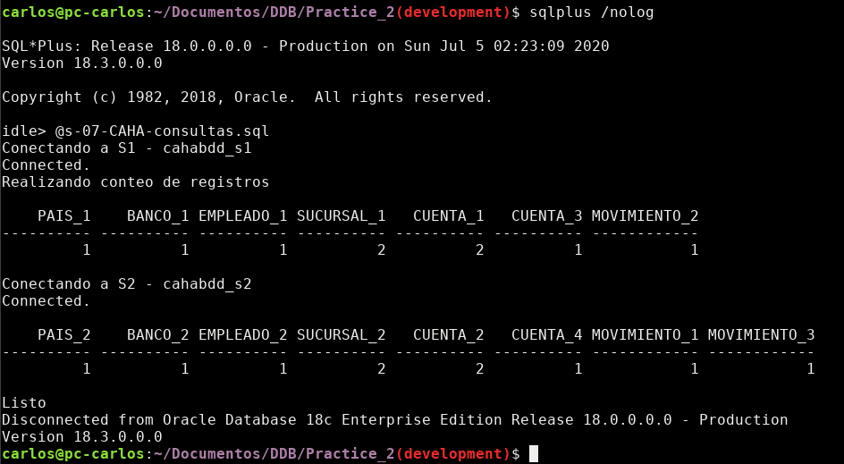

# Distributed Data Bases

## Practices of Relational Distributed DataBases Course

### Practice 1

**Given a Problem where a distributed database has 2 nodes,
create a Fragmentation Scheme, define relational algebra to
fragment each table, write Reconstruction Expressions and create
Relational Model for each node using Crow's foot notation.**

#### Fragmentation Scheme


#### Reconstruction Expressions


#### Relational Model for Node 1 called s1


#### Relational Model for Node 2 called s2


Create [paper](/Practice_1/P1.tex) where all of this is defined.

### Practice 2

**According to Fragmentatio Scheme in Practice 1,
create a distributed database.**

Activies:

1. [Define tables
2. Constraints
3. Some data
4. Queries to retrieve information of constraints' names,
number of rows for each table and tables defined for each node.

#### Tables defined for each node

- [Tables for node s1](/Practice_2/s-02-CAHA-n1-ddl.sql)
- [Tables for node s2](/Practice_2/s-02-CAHA-n2-ddl.sql)

Using script to create [tables](/Practice_2/s-03-CAHA-main-ddl.sql)


In image can be seen tables created for each node.

#### Foreign References defined for each node

- [tables' constraints for s1](/Practice_2/s-05-CAHA-consulta-restricciones-n1.sql)
- [tables' constraints for s2](/Practice_2/s-05-CAHA-consulta-restricciones-n2.sql)

Using script to retrieve  [tables' foreign references ](/Practice_2/s-05-CAHA-consulta-restricciones-main.sql)
, first column is child table, second is reference name and last parent table.


#### Initial Data Inserted

- [data](/Practice_2/s-06-CAHA-carga.sql)

Using [script](/Practice_2/s-07-CAHA-consultas.sql) to count rows for each table.



### Practice 3

**Impletended Local Mapping Transparency (is when the end user or
programmer must specify both the fragment' name and their locations)**

This requirement was achieved using database links, the DDL code to
create those links are derfined in the script
[s-02-CAHA-creacion-ligas.sql](/Practice_3/s-02-CAHA-creacion-ligas.sql).

After creating those database links, we can use them to get data
from another node's using the node's global name, in this case
there are two nodes:

- CAHABDD_S1: __cahabdd_s1.fi.unam__
- CAHABDD_S2: __cahabdd_s2.fi.unam__

After creating database links, Local Mapping Transparency can be used,
for example retrieve all data from entity PAIS from node s1:

```sql
    select pais_id, clave, nombre, zona_economica
        from f_cah_pais_1
        union all
    select pais_id
        from f_cah_pais_2@cahabdd_s2.fi.unam
```

In the script [s-03-CAHABDD_S1-consultas.sql](/Practice_3/s-03-CAHABDD_S1-consultas.sql)
and [s-03-CAHABDD_S2-consultas.sql](/Practice_3/s-03-CAHABDD_S2-consultas.sql),
get data from the other node to count the number of rows for each entity defined
in the schema, where reconstruction expression are used, which were defined in
*Practice_1*.

Results after running these script on each node:

For node CAHABDD_S1 after running s-03-CAHABDD_S1-consultas.sql:


For node CAHABDD_S2 after running s-03-CAHABDD_S2-consultas.sql:


As seen, both results are the same, the only thing that change
in both scripts are the reconstruction expressions used and
the fragments that are obtained from the other node.

Add [s-00-carga-blob-en-bd.sql](/Practice_3/s-00-carga-blob-en-bd.sql)
and [s-00-guarda-blob-en-archivo.sql](/Practice_3/s-00-guarda-blob-en-archivo.sql)
to import BLOB data to database and export BLOB data from database to a system file.
Script [s-04-prepara-carga-archivos.sql](/Practice_3/s-04-prepara-carga-archivos.sql)
is used to verify this scripts work correctly and import and export some data to
the database.

Result after running script:


As can be seen, data was imported and exported succesfully.

### Practice 4

Implemented Localization and Fragmentantion Transparency for SELECT.

The first one enables to retrieve info from a fragment without specifying its location
(node where the fragment is at).

The second one is to retrieve info from a global entity like if it were
a entity on a centralized database, uses reconstruction expression
for each entity.

For example, to retrieve all info from entity PAIS from node CAHABDD_S1
using Local Mapping Transparency, it would be like:

```sql
    select pais_id, clave, nombre, zona_economica
        from f_cah_pais_1
        union all
    select pais_id, clave, nombre, zona_economica
        from f_cah_pais_2@cahabdd_s2;
```

Result is:


using Localization Transparency:

```sql
    select pais_id, clave, nombre, zona_economica
        from pais_1
        union all
    select pais_id, clave, nombre, zona_economica
        from pais_2;
```

Result is:


using Fragmentation Transparency:

```sql
    select pais_id, clave, nombre, zona_economica
        from pais;
```

Result is:


As seen in each image, the result is the same, just
change the way query was written.

Fragmentantion Transparency makes querying for programmer
much easier because he shouldn't know Fragmentation Scheme
to use the Distribuited Database.

### Practice 5

Implemented Fragmentantion Transparency for
_INSERT_, _UPDATE_ and _DELETE_ operations.

This requirement was created using INSTEAD OF TRIGGERS for each
entity.

Created _INSERT_ and _DELETE_ transparency for following entities:

1. PAIS
1. SUCURSAL
1. CUENTA
1. MOVIMIENTO

Just for __PAIS__ entity, _UPDATE_ transparency was implemented.

1. [Trigger for PAIS entity - both nodes](/Practice_5/s-03-CAHA-pais-trigger.sql)
2. [Trigger for SUCURSAL entity - node s1](/Practice_5/s-03-CAHA-sucursal-n1-trigger.sql)
3. [Trigger for SUCURSAL entity - node s2](/Practice_5/s-03-CAHA-sucursal-n2-trigger.sql)
4. [Trigger for CUENTA entity - node s1](/Practice_5/s-03-CAHA-cuenta-n1-trigger.sql)
5. [Trigger for CUENTA entity - node s2](/Practice_5/s-03-CAHA-cuenta-n2-trigger.sql)
6. [Trigger for MOVIMIENTO entity - node s1](/Practice_5/s-03-CAHA-movimiento-n1-trigger.sql)
7. [Trigger for MOVIMIENTO entity - node s2](/Practice_5/s-03-CAHA-movimiento-n2-trigger.sql)

[Script to create all triggers](Practice_5/s-04-CAHA-main-triggers.sql)
